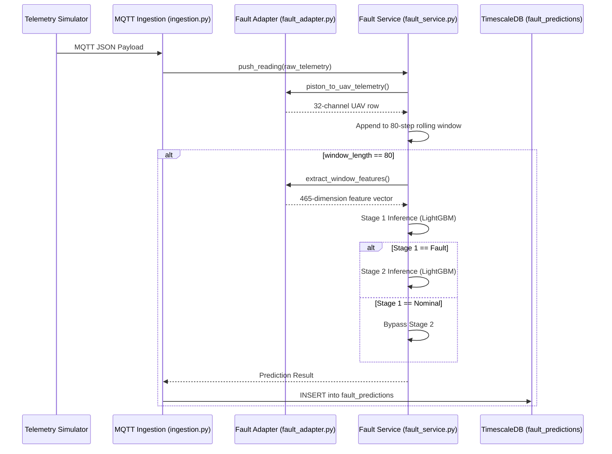

# Fault Model Pipeline Flow

This document details the data flow and implementation architecture for integrating the **Two-Stage LightGBM Fault Model** into the AeroTwin backend.

## 1. Architecture Overview

## 2. Telemetry Translation (Piston to UAV)

Because the ALFA fault model was trained on UAV telemetry, the incoming piston-engine telemetry must be mapped to the model's expected 32-channel schema. This is handled by `fault_adapter.py`.

### Channel Mapping Strategy:
- **Vibration → IMU Accel:** `vibration_x`, `vibration_y`, `vibration_z` map directly to `IMU_AccX`, `IMU_AccY`, and `IMU_AccZ` (with gravity compensation on Z).
- **Vibration Rate → IMU Gyro:** `IMU_GyrX/Y/Z` are derived from the frame-to-frame delta of the vibration signals.
- **Engine Temps/Pressures → Barometer Proxies:** `cht`, `egt`, `oil_pressure`, and `oil_temp` serve as proxies for `BARO_Temp`, `BARO_Alt`, `BARO_Press`, and `BARO_CRt`.
- **Engine RPM/Fuel → Battery Proxies:** `rpm` maps to `BAT_Volt` and `fuel_flow` maps to `BAT_Curr`.
- **Missing Channels:** Unused UAV channels (like `ATT_Roll`, `GPS_NSats`, etc.) are filled with constant nominal defaults to prevent noise and stabilize the feature extraction.

## 3. Feature Extraction

Once the 80-sample (4-second) rolling buffer is full, 465 features are extracted:

1. **Statistical Moments (448 features):** For all 32 channels, 14 statistics are calculated: `mean`, `std`, `min`, `max`, `peak-to-peak`, `skewness`, `kurtosis`, `rate_mean`, `rate_std`, `rate_max`, and 4 spectral FFT bands (`band0`, `band1`, `band2`, `band3`).
2. **Residual & Norm Features (17 features):** Custom mathematical derivations combining multiple channels, such as EKF residuals (`resid_ATT_Roll_XKF1_Roll`), acceleration norms (`acc_norm`), and vibration magnitude norms.

## 4. Model Inference

The inference pipeline consists of two distinct LightGBM models loaded by `fault_service.py`:

- **Stage 1 (Binary Detector):** Classifies the 465-feature vector as either `0` (Nominal) or `1` (Fault Active).
- **Stage 2 (Multiclass Isolator):** If Stage 1 detects a fault, Stage 2 identifies the exact fault mode (classes 1-6).

## 5. Output and DB Persistence

The final output is stored in the `fault_predictions` database table:

| Field | Type | Description |
|-------|------|-------------|
| `ts` | DateTime | Timestamp of the prediction |
| `class_id` | Integer | The integer ID (0-6) representing the fault class |
| `fault_class` | String | Human readable label matching the DB CHECK constraint |
| `confidence` | Float | The probability score (0.0 - 1.0) of the predicted class |
| `probabilities`| JSON | A 7-element float array containing the full probability distribution across all classes |

### Valid Fault Classes (CHECK Constraint)
- `'No Failure'` (0)
- `'RC Failure'` (1)
- `'GPS Failure'` (2)
- `'Accelerometer Failure'` (3)
- `'Gyro Failure'` (4)
- `'Compass Failure'` (5)
- `'Barometer Failure'` (6)
